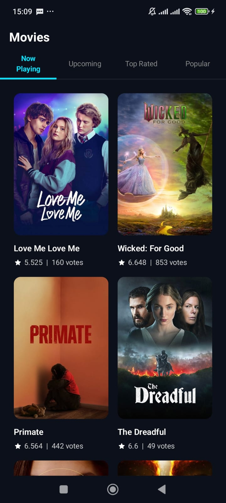
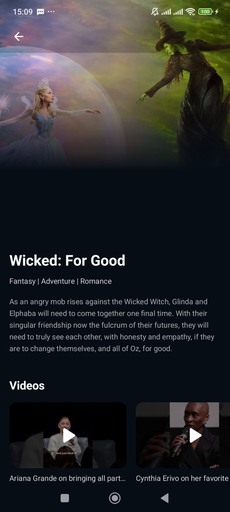

# Movie Catalog

A modern Android application that displays a catalog of movies. The app features a home screen with an endless scrolling list of movies and a detailed screen showing comprehensive movie information, reviews, and video trailers.

It is built with a focus on modern Android development practices, utilizing Clean Architecture, Jetpack Compose, robust offline support, and enterprise-level security standards.

## Screenshots

|                      Splash Screen                      |                      Movie List Screen                      |                      Movie Detail Screen                      |
|:-------------------------------------------------------:|:-----------------------------------------------------------:|:-------------------------------------------------------------:|
|  |  |  |


## Architecture

The project follows **Clean Architecture** principles and is modularized by feature (vertical slicing) combined with layered modules for core functionalities:
- `:app` - The main application entry point holding the dependency injection setup and navigation graph.
- `:feature:movie` - Contains the UI (Presentation), Domain, and Data layers specific to the movie feature (Home and Movie Details).
- `:core:network` - Handles all API communication and network configurations.
- `:core:database` - Manages local data persistence using Room for offline caching.

The presentation layer utilizes the **MVI (Model-View-Intent)** pattern integrated with Jetpack Compose State Management and Kotlin Flows to handle UI state predictably and ensure strict Unidirectional Data Flow (UDF).

## ️ Tech Stack & Libraries

- **Language**: [Kotlin](https://kotlinlang.org/) (v2.0.21)
- **UI Toolkit**: [Jetpack Compose](https://developer.android.com/jetpack/compose) for building native UI declaratively with Adaptive UI handling.
- **Asynchrony**: [Coroutines](https://kotlinx.coroutines.org/) & [Flow](https://kotlin.github.io/kotlinx.coroutines/kotlinx-coroutines-core/kotlinx.coroutines.flow/-flow/) for asynchronous programming and reactive streams.
- **Dependency Injection**: [Dagger Hilt](https://dagger.dev/hilt/) (v2.56.2) for managing dependencies across the app.
- **Networking**:
    - [Retrofit](https://square.github.io/retrofit/) for declarative REST API consumption.
    - [OkHttp](https://square.github.io/okhttp/) for underlying HTTP client logging.
    - [Chucker](https://github.com/ChuckerTeam/chucker) for on-device network inspection.
- **Local Database (Caching)**: [Room](https://developer.android.com/training/data-storage/room) for offline support and caching network responses.
- **Pagination**: [Paging 3](https://developer.android.com/topic/libraries/architecture/paging/v3-overview) utilizing `RemoteMediator` to seamlessly load and cache paginated data from the network into the local database.
- **Image Loading**: [Coil Compose](https://coil-kt.github.io/coil/compose/) for fast, lightweight image loading.
- **Serialization**: [Kotlinx Serialization](https://kotlinlang.org/docs/serialization.html) for fast JSON parsing and Type-Safe Navigation.
- **In-App Navigation**: [Navigation Compose](https://developer.android.com/jetpack/compose/navigation) for navigating between Compose screens.
- **Video Player**: [Android YouTube Player](https://github.com/PierfrancescoSoffritti/android-youtube-player) for inline trailer playback.

## Key Features

- **Movie List (Home)**: Browse an endless list of movies backed by Paging 3 and cached in Room for offline viewing.
- **Movie Details**: View comprehensive movie information, including a hero section, detailed overview, user reviews (bottom sheet), and inline YouTube trailers.
- **Offline-First Support**: Uses `RemoteMediator` with a smart cache timeout mechanism to cache API data into the local Room database, ensuring the app remains usable even without a network connection.
- **Enterprise Security Setup**: Secure local session handling using `EncryptedSharedPreferences` backed by Android Keystore, and API Keys injected securely via `BuildConfig` to prevent reverse-engineering leaks.

## Getting Started

### Prerequisites
- Android Studio Ladybug (or newer).
- JDK 17 (configured in Android Studio).

### Building the Project
1. Clone the repository to your local machine.
2. Open the project in Android Studio.
3. To securely build the app, create a `local.properties` file in the root directory and add your API Key:
   ```properties
   API_KEY="your_api_key_here"
   TMDB_ACCESS_TOKEN="your_api_access_token"